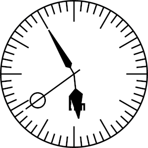

# elm-clock
An analog clock that adjusts its size. Written in Elm and SVG.

## About

Demonstrates how to get the local time zone and 
using SVG to draw a clock. 

The clock adapts its size to the parent container.

## Clock face

The function `clockFace` draws a circle and calls
the helper `tickMarks` to mark the perimeter with minute
indicators. 

The clock has its center at (0,0) to make life
easier. It is therefore translated (50,50) which
is dependent on the size being (100,100).

## Hands

The hands have different styles but have
the common problem of calculating the angle. 

The angle is zero at 15 minutes passed so to
calculate the angle, you first reduce by 15 
and multiply 360 (degrees) and then divide
by 60 (minutes).

To draw a hand, it is transformed using the SVG
`transform` function with the `rotate` argument, passing
the angle as a parameter.

The hand is a line from center of the clock and
some circle or polygon, depending on which hand.

## Letters E, L, M

For some reason, these letters appear on the clock face. They are not
of any font, they are polygons.